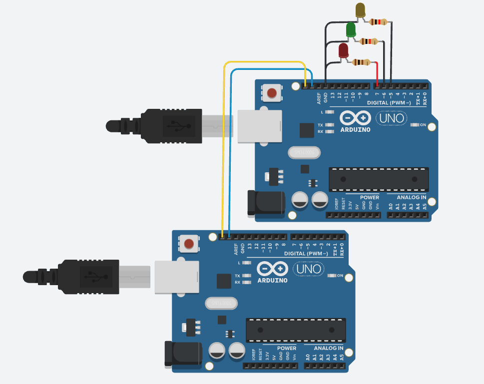

# I2C Protocol

The `I2C` (Inter-Integrated Circuit) protocol is a widely used serial communication protocol in embedded systems. It enables data transmission between a master device and one or more slave devices in a synchronous and `half-duplex` mode. `I2C` is often used to communicate with sensors, displays, memory chips, and other peripherals.

## Operation

`I2C` communication involves two wires:

- **`SDA` (Serial Data Line)**: Used for transmitting and receiving data.
- **`SCL` (Serial Clock Line)**: Responsible for providing the clock signal that synchronizes data transmission.

`I2C` communication is based on addresses of slave devices. The master initiates communication, specifies the slave device it wants to interact with, and sends or receives data through the `SDA` and `SCL` wires. Slave devices can respond to master commands with data or perform specific actions.

## Simulation

The implementation of the `I2C` protocol was carried out in a simulator called [Tinkercad](https://www.tinkercad.com/) due to its availability and compatibility with the Arduino Uno.

Corresponding code for the [master](./src/sketch_uno328p_master.ino) and [slave](./src/sketch_uno328p_slave.ino).

## Objectives

The task was to design a program that uses the `I2C` protocol, where the master sends three different messages to the slave, and the slave recognizes these messages to control specific LEDs. There are four use cases:

1. Sending the character "G" turns on or off the green LED.
2. Sending the character "R" turns on or off the red LED.
3. Sending the character "Y" turns on or off the yellow LED.
4. Sending the character "C" clears (turns off) all the illuminated LEDs.

These simulations illustrate the functionality and versatility of the `I2C` protocol in enabling serial communication between a master and a slave, with real-world applications including the control of various devices and peripherals.