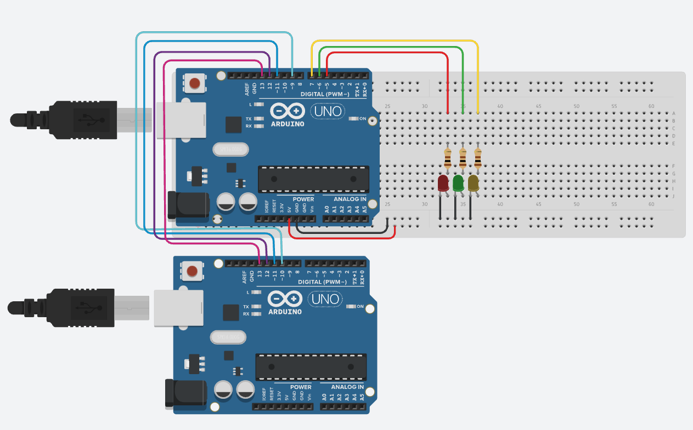

# SPI Protocol

The `SPI` (Serial Peripheral Interface) protocol is a widely used serial communication protocol in embedded systems. It facilitates data transmission between a master device and one or more slave devices in a synchronous and full-duplex manner. `SPI` is often used for communicating with various peripherals, such as sensors, displays, and memory chips.

## Operation

`SPI` communication involves multiple wires and components:

- **`MOSI` (Master Out Slave In)**: The master sends data to the slave through this line.
- **`MISO` (Master In Slave Out)**: The slave sends data to the master through this line.
- **`SCK` (Serial Clock)**: A clock signal generated by the master to synchronize data transmission.
- **`SS` (Slave Select)**: A line used to select the specific slave device with which the master wants to communicate.

The master device initiates communication by pulling the `SS` line low. It then sends data to the selected slave through `MOSI` while receiving data from the slave through `MISO`. `SPI` uses a shift register mechanism to exchange data.

## Simulation

The implementation of the `SPI` protocol was carried out in a simulator called [Tinkercad](https://www.tinkercad.com/) due to its availability and compatibility with the Arduino Uno.

Corresponding code for the [master](./src/sketch_master_uno328p.ino) and [slave](./src/sketch_slave_uno328p.ino).

## Objective

The task was to design a program that uses the `SPI` protocol, where the master sends three different messages to the slave, and the slave recognizes these messages to control specific LEDs. There are four use cases:

1. Sending the character "G" turns on or off the green LED.
2. Sending the character "R" turns on or off the red LED.
3. Sending the character "Y" turns on or off the yellow LED.
4. Sending the character "C" clears (turns off) all the illuminated LEDs.

These simulations illustrate the functionality and versatility of the `SPI` protocol in enabling serial communication between a master and a slave, with real-world applications including controlling various devices and peripherals.
