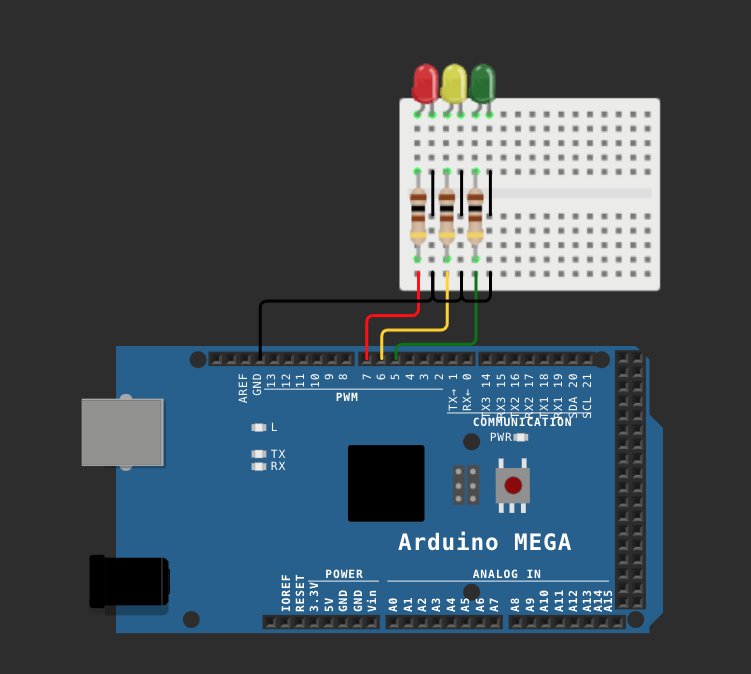
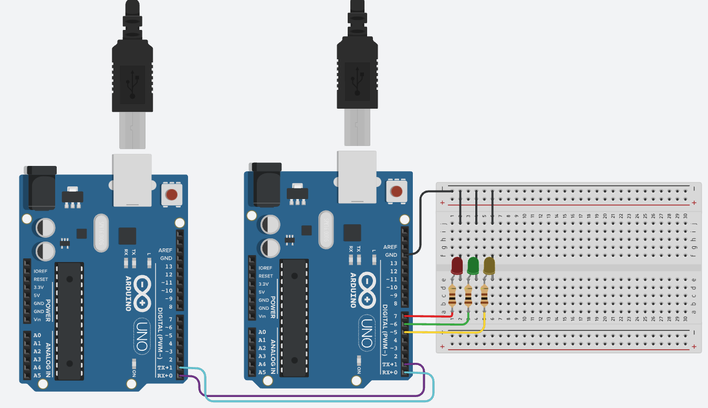

# USART Protocol

The `USART` (Universal Synchronous Asynchronous Receiver Transmitter) protocol is a widely used serial communication method in embedded systems, enabling data transmission and reception between devices asynchronously or synchronously. It is commonly employed for communication between microcontrollers, computers, and other devices.

## Operation

`USART` sends and receives data through two pins known as TX (Transmit) and RX (Receive). In the case of asynchronous communication, devices must be configured with the same baud rate (transmission speed) to ensure successful communication. Data is transmitted in the form of packets, typically comprising a byte of data, optional parity bits, and stop bits. The receiver waits for data and verifies packet integrity.

## Simulation

To demonstrate the operation of the `USART` protocol, we conducted simulations using two simulators: [Wokwi](https://wokwi.com/) and [Tinkercad](https://www.tinkercad.com/). Each simulator employs different Arduino models based on compatibility.

### Wokwi

In the Wokwi simulator, a single Arduino, specifically the Arduino Mega, was used to showcase communication via the `USART` protocol. The objective is to transmit a signal using the protocol and, based on the received character, illuminate or extinguish a specific LED. Reading and writing on the Serial Monitor.

[Corresponding code.](./src/sketch_mega2560.ino)

### Tinkercad

In Tinkercad, two Arduino Uno boards were used to simulate communication between devices via the `USART` protocol. However, similar to Wokwi, the goal is still to transmit a signal and control LEDs based on received characters.

Corresponding code for the [master](./src/sketch_uno328p_master.ino) and [slave](./src/sketch_uno328p_slave.ino).

## Objectives

The two simulation codes share a common goal: from a signal transmitted and received via the `USART` protocol, generate a visual output by activating specific LEDs. There are four use cases:

1. Sending the character "G" turns on or off the green LED.
2. Sending the character "R" turns on or off the red LED.
3. Sending the character "Y" turns on or off the yellow LED.
4. Sending the character "C" clears (clear) all the illuminated LEDs.

These simulations demonstrate the versatility and utility of the USART protocol in serial communication applications and device control in embedded systems.
